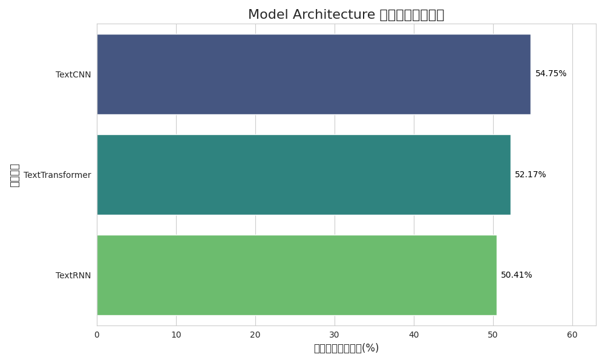
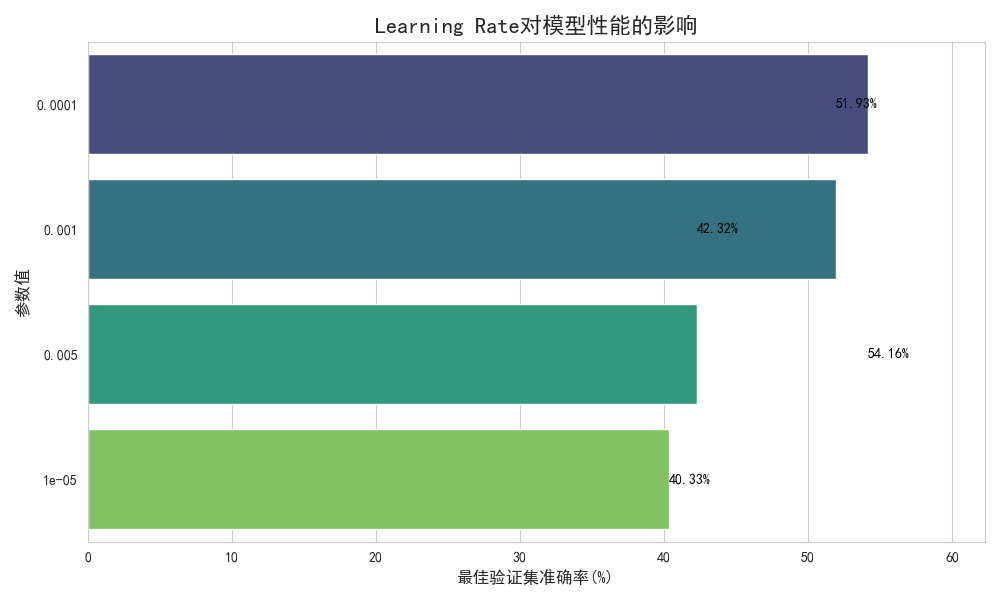

# FNLP 任务二：文本分类模型实验平台

本项目是一个为“自然语言处理基础”课程任务设计的实验平台，专注于实现、训练和评估多种深度学习模型在文本分类任务上的表现。平台支持 TextCNN、TextRNN (LSTM) 和 TextTransformer 等主流模型，并提供了一套完整的实验流程，用于对比不同超参数（如学习率、优化器、模型结构等）对模型性能的影响。

## ✨ 功能特性

- **多种模型支持**：内置 `TextCNN`, `TextRNN (LSTM)`, `TextTransformer` 等多种经典的文本分类模型。
- **自动化实验流程**：通过运行单个脚本 (`run_experiment.py`)，可以自动化执行一系列预设的对比实验。
- **灵活的参数配置**：所有实验参数（如模型超参数、训练设置等）均在 `configs.py` 中集中管理，易于修改和扩展。
- **预训练词向量**：支持加载和使用 GloVe 预训练词向量，并能对比其与随机初始化向量的效果。
- **动态学习率调整**：集成了带 `warmup` 的余弦退火学习率调度器，以优化训练过程。
- **结果可视化**：实验结束后，自动生成对比图表并保存到 `results/charts` 目录下，直观展示不同设置下的模型性能。
- **最佳模型保存**：在训练过程中，自动保存验证集上表现最佳的模型权重。

## 📂 目录结构

```
FNLP-Task-2/
├───configs.py              # 全局配置文件，管理所有超参数和路径
├───dataset.py              # PyTorch 数据集类定义
├───run_experiment.py       # 自动化实验运行脚本（主要入口）
├───train.py                # 单次模型训练与评估的核心逻辑
├───data/                     # 数据目录
│   ├───new_train.tsv         # 训练数据集
│   ├───new_test.tsv          # 测试数据集
│   └───glove.6B.300d.txt     # GloVe 预训练词向量
├───models/                   # 模型定义目录
│   ├───TextCNN.py
│   ├───TextRNN.py
│   └───TextTransformer.py
├───results/                  # 实验结果输出目录
│   ├───experiment_results.csv # 所有实验的量化结果表格
│   └───charts/                # 自动生成的性能对比图表
├───saved_models/             # 训练过程中保存的最佳模型权重
└───utils/                    # 工具脚本目录
    ├───plotting.py           # 绘图工具
    ├───preprocess.py         # 数据预处理函数
    └───vocabulary.py         # 词汇表构建与管理
```

## 🚀 环境搭建

1.  **克隆项目**
    ```bash
    git clone <your-repository-url>
    cd FNLP-Task-2
    ```

2.  **创建虚拟环境 (推荐)**
    ```bash
    python -m venv venv
    # Windows
    venv\Scripts\activate
    # macOS/Linux
    source venv/bin/activate
    ```

3.  **安装依赖**
    项目依赖 `torch`, `pandas`, `scikit-learn`, `matplotlib`, `seaborn`, `tqdm` 等库。你可以创建一个 `requirements.txt` 文件并使用 pip 安装。

    *   **创建 `requirements.txt` 文件**，并填入以下内容：
        ```
        torch
        pandas
        scikit-learn
        matplotlib
        seaborn
        tqdm
        transformers
        ```

    *   **执行安装**：
        ```bash
        pip install -r requirements.txt
        ```

4.  **准备数据**
    - 将训练数据 `new_train.tsv` 和测试数据 `new_test.tsv` 放入 `data/` 目录下。
    - 下载 GloVe 预训练词向量 (例如 `glove.6B.300d.txt`) 并将其放入 `data/` 目录下。你可以在 [GloVe 官网](https://nlp.stanford.edu/projects/glove/) 下载。

## 💡 使用方法

### 1. 运行完整的对比实验

直接运行 `run_experiment.py` 脚本即可启动所有预设的实验。这会自动进行多组对比测试，并将结果保存在 `results/` 目录下。

```bash
python run_experiment.py
```

该脚本会依次执行以下实验：
- 不同学习率对性能的影响
- 不同优化器（Adam vs SGD）的对比
- TextCNN 不同卷积核配置的对比
- 使用/不使用 GloVe 词向量的对比
- TextCNN, TextRNN, TextTransformer 三种模型架构的对比

### 2. 训练单个模型

如果你想训练单个特定配置的模型，可以修改 `configs.py` 文件中的参数，然后直接运行 `train.py`。

```bash
# 1. 在 configs.py 中设置你想要的模型和参数
# 2. 运行训练脚本
python train.py
```

## 📊 实验结果

所有实验的量化指标（准确率、耗时）会以 CSV 格式保存在 `results/experiment_results.csv` 中。

同时，可视化的对比图表会自动生成并保存于 `results/charts/` 目录下，例如：

- **模型架构对比 (`Model_Architecture_comparison.png`)**
  

- **学习率对比 (`Learning_Rate_comparison.png`)**
  

（此处可根据需要展示更多图表）
